<div align="center">


<br/><br/>

[](https://github.com/Safwen-amaira)
[](https://github.com/Safwen-amaira)


</div>

---

## 🧠 CORE IDENTITY MATRIX

```bash
┌─────────────────────────────────────────────────────────────────────────────┐
│                                                                             │
│    ╔══════════════════════════════════════════════════════════════════════╗ │
│    ║  ██╗  ██╗ █████╗ ███╗   ██╗██╗ ██████╗ █████╗ ██████╗                ║ │
│    ║  ██║  ██║██╔══██╗████╗  ██║██║██╔════╝██╔══██╗██╔══██╗               ║ │
│    ║  ███████║███████║██╔██╗ ██║██║██║     ███████║██████╔╝               ║ │
│    ║  ██╔══██║██╔══██║██║╚██╗██║██║██║     ██╔══██║██╔══██╗               ║ │
│    ║  ██║  ██║██║  ██║██║ ╚████║██║╚██████╗██║  ██║██║  ██║               ║ │
│    ║  ╚═╝  ╚═╝╚═╝  ╚═╝╚═╝  ╚═══╝╚═╝ ╚═════╝╚═╝  ╚═╝╚═╝  ╚═╝               ║ │
│    ╠══════════════════════════════════════════════════════════════════════╣ │
│    ║                                                                      ║ │
│    ║  ┌──(core㉿hanicar)-[~/identity]                                     ║ │
│    ║  └─$ systemctl status safwen-amaira --full                           ║ │
│    ║                                                                      ║ │
│    ║  ● Name              : Safwen Amaira                                 ║ │
│    ║  ● Title             : CEO & Autonomous Defense Architect            ║ │
│    ║  ● Company           : Hanicar Security [hanicar.tn]                 ║ │
│    ║  ● Role Stack        : Software Engineer · SOC Analyst               ║ │
│    ║                       Threat Hunter · WAF Engineer                   ║ │
│    ║                       Red/Blue Team Operator                         ║ │
│    ║  ──────────────────────────────────────────────────────────────────  ║ │
│    ║  ● AI Engine         : [🔴 ONLINE]    Threat Models  : [✅ LOADED]   ║ │
│    ║  ● SOAR Module       : [✅ ACTIVE]    Auto-Response  : [⚡ ARMED]     ║ │
│    ║  ● Philosophy        : Build intelligent systems that outthink       ║ │
│    ║                       attackers                                      ║ │
│    ║                                                                      ║ │
│    ║  [SYSTEM] Status: FULLY OPERATIONAL | Uptime: 365d 24h 7m 365d       ║ │
│    ║  [AI CORE] Evolution Cycle: ACTIVE | Neural Nets: 4/4 ONLINE         ║ │
│    ║                                                                      ║ │
│    ╚══════════════════════════════════════════════════════════════════════╝ │
│                                                                             │
└─────────────────────────────────────────────────────────────────────────────┘

```

## ⚡ HANICAR SECURITY — Tunisian Cybersecurity platform (SaaS).

<div align="center">
  <a href="https://hanicar.tn" target="_blank">
    
  </a>
</div>

<br/>

> **Hanicar is a live, autonomous cybersecurity platform** — AI-driven detection, zero-touch mitigation, built by a student while protecting enterprise-grade clients. This is not a side project. This is a production engine.

<div align="center">

| ⚡ Metric | 📊 Value | 🔍 Technical Detail |
|:---|:---:|:---|
| **Detection Throughput** | `100,000+` events/sec | Real-time Kafka/Elastic pipeline |
| **MTTD Improvement** | `-68%` | AI triage vs. manual SOC baseline |
| **Active Clients** | `10+` orgs | Finance & critical infrastructure |
| **Response Mode** | `Zero-touch` | Fully autonomous SOAR mitigation |
| **Intelligence Stack** | `Full-chain` | SIEM · TI · SOAR · UEBA · OSINT |

</div>
## 🧬 THE EVOLUTION CYCLE

```mermaid
flowchart LR
    A[⚔️ ATTACK<br/>Simulate & probe] --> B[🔍 ANALYZE<br/>Parse & correlate]
    B --> C[🚨 DETECT<br/>Score & triage]
    C --> D[🤖 RESPOND<br/>Auto-mitigate & close]
    D --> E[📚 LEARN<br/>Extract & document]
    E --> F[🧬 EVOLVE<br/>Harden & publish TI]
    F --> A
    
    style A fill:#1a1a1a,stroke:#FFD700,stroke-width:2px
    style B fill:#1a1a1a,stroke:#FFD700,stroke-width:2px
    style C fill:#1a1a1a,stroke:#FFD700,stroke-width:2px
    style D fill:#1a1a1a,stroke:#FFD700,stroke-width:2px
    style E fill:#1a1a1a,stroke:#FFD700,stroke-width:2px
    style F fill:#1a1a1a,stroke:#FFD700,stroke-width:2px
```

<p align="center">
  <i>Every breach is a lesson. Every lesson becomes a rule. Every rule becomes an autonomous reflex.</i>
</p>


---

## 📦 Section 5: Operational Domains 

```markdown
## ⚔️ OPERATIONAL DOMAINS

<div align="center">
  <table width="100%">
    <tr>
      <td width="50%" valign="top">
        <h3 align="center">🔴 OFFENSIVE SECURITY</h3>
        
        [✅] Recon & OSINT automation pipelines
        [✅] Custom exploit development
        [✅] Red team adversary emulation
        [✅] Web app pentesting (Burp/OWASP)
        [✅] Social engineering simulations
      </td>
      <td width="50%" valign="top">
        <h3 align="center">🔵 DEFENSIVE SECURITY</h3>
        
        [✅] Detection engineering (Sigma/YARA)
        [✅] SIEM architecture (Wazuh/Splunk)
        [✅] Incident automation (SOAR)
        [✅] Threat hunting & IOC enrichment
        [✅] ISO 27001/27002 · PCI DSS
      </td>
    </tr>
    <tr>
      <td width="50%" valign="top">
        <h3 align="center">🌐 WEB & NETWORK SECURITY</h3>
        
        [✅] Reverse proxy hardening
        [✅] WAF rule engineering (custom sets)
        [✅] API rate limiting & DDoS mitigation
        [✅] Secure headers / CSP / CORS
        [✅] AI-driven bot detection systems
      </td>
      <td width="50%" valign="top">
        <h3 align="center">🧠 AI/ML DEFENSE</h3>
        
        [✅] ML-based anomaly detection
        [✅] Adversarial ML & model poisoning
        [✅] Proprietary threat scoring
        [✅] UEBA behavioral modeling
        [✅] Adaptive autonomous response
      </td>
    </tr>
  </table>
</div>

```

## 🚀 FLAGSHIP PROJECTS — HANICAR LABS

<div align="center">
  <table width="100%">
    <tr>
      <td width="50%" valign="top">
        <h3 style="color:#FFD700;">🔥 Red‑Hunter</h3>
        <i>AI-driven SOC alert engine</i><br/>
        Real-time risk scoring, automated triage, MITRE ATT&CK mapping.
        
        `Python · Elastic · Kafka · Redis`
      </td>
      <td width="50%" valign="top">
        <h3 style="color:#FFD700;">☁️ CloudShield</h3>
        <i>Intelligent autonomous reverse proxy</i><br/>
        Behavioral DDoS filtering, AI bot detection, automatic IP reputation.
        
        `Go · Nginx · Lua · Redis`
      </td>
    </tr>
    <tr>
      <td width="50%" valign="top">
        <h3 style="color:#FFD700;">🧠 Threat Recommender</h3>
        <i>LLM-powered response assistant</i><br/>
        Alerts → MITRE ATT&CK mapping → playbook recommendations.
        
        `LangChain · OpenAI · ChromaDB · FastAPI`
      </td>
      <td width="50%" valign="top">
        <h3 style="color:#FFD700;">🕸️ PacketSentry</h3>
        <i>Deep packet inspection engine</i><br/>
        Real-time anomaly detection with sub-millisecond blocking.
        
        `C++ · DPDK · Suricata · PF_RING`
      </td>
    </tr>
  </table>
</div>

---

## 🧰 TECHNICAL ARSENAL

<div align="center">

**Languages**


**Security Tools**


**Infrastructure**


</div>
## 📊 GITHUB INTELLIGENCE

<div align="center">
  
  
</div>

<div align="center">
  
  
</div>

<div align="center">
  
</div>

---

## 🎓 CURRENT FOCUS

| Track | Progress | Status |
|:------|:--------:|:------:|
| 📖 OSCP Offensive Security | ▓▓▓▓▓▓▓░░░ 73% | 🟡 Active |
| 🤖 AI Deception Network | ▓▓▓▓░░░░░░ 40% | 🟡 Building |
| 🔬 Adversarial ML Research | ▓▓▓░░░░░░░ 30% | 🔵 Researching |
| 📡 TN Threat Intel Platform | ▓▓░░░░░░░░ 20% | ⚪ Planning |
| 📘 Blog: "From Code to Shell" | ▓▓▓▓▓░░░░░ 50% | 🟡 Writing |

> 🎯 *Managing a live cybersecurity company, building real enterprise products, and grinding the degree — simultaneously. This is the operating baseline.*
## 🌍 CONNECT

<div align="center">

[](https://hanicar.tn)
[](https://linkedin.com/in/safwen-amaira)
[-FOLLOW-000?style=for-the-badge&logo=x&logoColor=FFD700&labelColor=000)](https://twitter.com/safwen_amaira)
[](https://github.com/Safwen-amaira)
[](mailto:safwen@hanicar.tn)

</div>

<br/>

<div align="center">
  
*"The only secure system is the one that adapts faster than its attackers."*

— **Safwen Amaira**, CEO, Hanicar Security

<br/>

🔍 **Open for:** Security Engineering Internships · AI Defense Research · CTF Collaborations

</div>

<br/>


